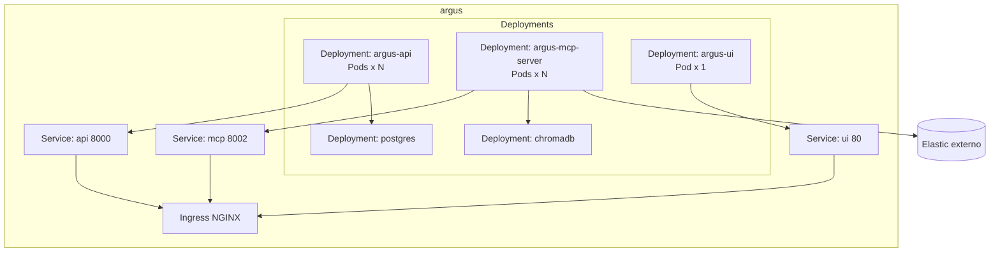
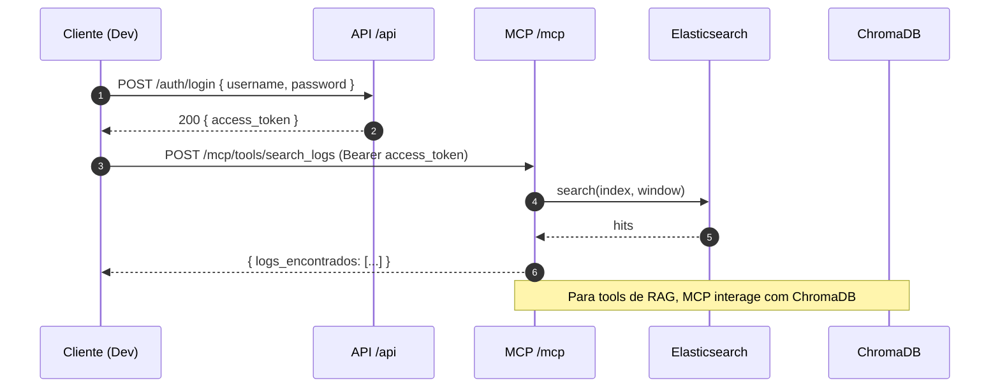

# Argus Agent - SRE Assistant

Este projeto implementa um agente de IA para análise de logs, construído com uma arquitetura modular e robusta, usando LangGraph e o protocolo MCP.

## Arquitetura
- **Aplicação Principal (`main.py`):** Serve a interface web (FastAPI) na porta 8000 e hospeda o cérebro do agente.
- **Servidor de Ferramentas (`tools/server.py`):** Um servidor MCP (FastMCP) que expõe as ferramentas para o agente na porta 8002.
- **RAG com ChromaDB:** Usa ChromaDB para criar uma base de conhecimento persistente com o histórico das análises, guardada na pasta `chroma_db`.

### Diagrama (visão de alto nível)

```mermaid
flowchart LR
  subgraph UI
    A[Frontend Angular<br/>Browser]
  end

  subgraph API
    APIRoutes[FastAPI /api (8000)<br/>Auth, Metrics, Users]
  end

  subgraph MCP
    Tools[MCP Server /mcp (8002)<br/>FastMCP Tools: search_logs / RAG / anomalies]
  end

  subgraph Data
    ES[(Elasticsearch)]
    CH[(ChromaDB)]
    PG[(PostgreSQL)]
  end

  A -->|HTTP| APIRoutes
  A -->|HTTP| MCP
  APIRoutes <-->|JWT| A
  MCP <-->|JWT/Service Token| A

  MCP -->|Query| ES
  MCP -->|RAG| CH
  APIRoutes -->|Users/Auth| PG
```

## Setup

1.  **Crie e entre no diretório do projeto:**
    ```bash
    mkdir argus-agent && cd argus-agent
    ```
    *Copie o conteúdo deste script para os ficheiros correspondentes dentro desta pasta.*

2.  **Copie a Configuração de Ambiente:**
    ```bash
    cp .env.example .env
    ```
    Edite o ficheiro `.env` e adicione as suas chaves de API e verifique as credenciais do Elasticsearch.

3.  **Crie o Ambiente Virtual e Instale as Dependências:**
    ```bash
    python3 -m venv .venv
    source .venv/bin/activate  # ou .venv\Scripts\activate no Windows
    uv pip install -r requirements.txt
    ```

## Como Executar

### Desenvolvimento Local (Sem Containers)

Você precisará de **dois terminais** a correr em simultâneo:

**Terminal 1: Inicie o Servidor de Ferramentas**
```bash
uv run uvicorn tools.server:app --port 8002 --reload
```

**Terminal 2: Inicie a Aplicação Principal**
```bash
uv run uvicorn main:app --port 8000 --reload
```

### Desenvolvimento com Docker

**Usando Docker Compose:**
```bash
# Standard
docker-compose up

# Com ChromaDB standalone
docker-compose -f docker-compose.chromadb.yml up

# Com debugging
docker-compose -f docker-compose.dev.yml up
```

**Usando Tilt (Kubernetes):**
```bash
tilt up
# Acesse a UI em http://localhost:10350
```

### Produção

Consulte a [documentação completa de deployment](docs/DEPLOYMENT.md).

```bash
# Deploy com Helm
helm install argus-prod ./helm/argus-agent \
  --namespace argus-production \
  --values k8s/prod/values.yaml
```

### Diagrama (Kubernetes/Helm)



## Documentação

- 📚 [Documentação Completa](docs/README.md)
- 🐳 [Guia de Containerização](docs/README-CONTAINERIZATION.md)
- 🚀 [Guia de Deploy](docs/DEPLOYMENT.md)
- 🏗️ [Arquitetura](app/docs/arquitetura.md)
- ☸️ [Kubernetes](k8s/README.md)

### Uso remoto do MCP Server (pt-BR)

O MCP Server expõe ferramentas HTTP sob `/mcp/` e exige autenticação via Bearer token.

- Endpoint base (sandbox): `https://argus.sandbox.tcloud-devops.cloudtotvs.com.br/mcp/`
- Health (sem auth): `GET /mcp/`
- Autenticação: obter `access_token` em `POST /api/auth/login` e enviar `Authorization: Bearer <token>`
- Exemplos de chamadas (search_logs, retrieve_historical_context, save_analysis_summary, detect_timeseries_anomalies) e snippet `curl` estão documentados em:
  - `mcp-server/README.md`

Boas práticas:
- Prefira janelas menores (ex.: `15m`, `1h`) para reduzir latência/custos no Elasticsearch
- Trate `401` (auth), `503` (dependências), e configure timeouts de 30–60s

### Sequência de chamada MCP com autenticação



