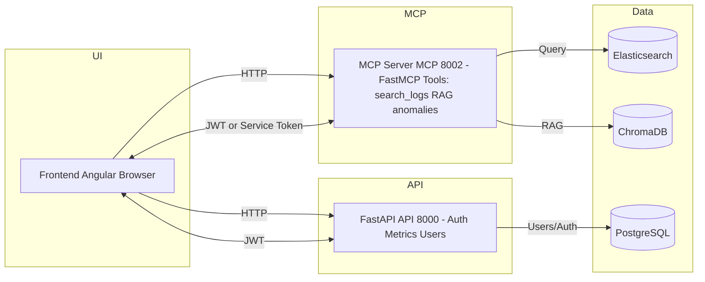
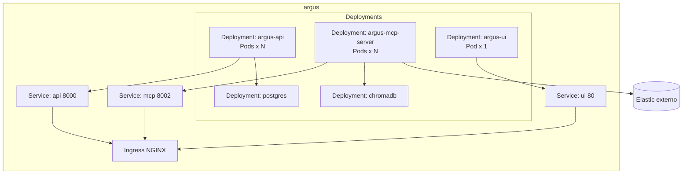

# Argus Agent - SRE Assistant

Agente de IA para análise de logs TOTVS Protheus, construído com arquitetura modular usando LangGraph, FastAPI, Angular e o protocolo MCP (Model Context Protocol).

## 🏗️ Arquitetura

O projeto é composto por três componentes principais:

### **1. API (`api/`)**
- **Framework**: FastAPI com orquestração LangGraph
- **Porta**: 8000
- **Responsabilidades**:
  - Autenticação JWT com PostgreSQL
  - Workflows de análise de logs (initial analysis, deep dive, chat)
  - Integração com provedores LLM (OpenAI, Google, Anthropic)
- **Documentação**: [api/README.md](api/README.md)

### **2. MCP Server (`mcp-server/`)**
- **Framework**: FastMCP (sobre FastAPI)
- **Porta**: 8002
- **Responsabilidades**:
  - Ferramentas MCP para busca de logs (Elasticsearch)
  - RAG com ChromaDB para contexto histórico
  - Detecção de anomalias em séries temporais
- **Documentação**: [mcp-server/README.md](mcp-server/README.md)

### **3. UI (`ui/`)**
- **Framework**: Angular 18 standalone + NGINX
- **Porta**: 8080 (desenvolvimento), 80 (produção)
- **Responsabilidades**:
  - Interface web para exploração de logs
  - Chat conversacional com IA
  - Design System TOTVS
- **Documentação**: [ui/README.md](ui/README.md)

### **Infraestrutura**
- **PostgreSQL**: Banco de dados para autenticação (porta 5433)
- **ChromaDB**: Banco vetorial para RAG (porta 8001)
- **Elasticsearch**: Fonte de dados de logs (externo)

### Diagrama (visão de alto nível)



## 🚀 Setup Rápido

### 1. Pré-requisitos

- **Docker & Docker Compose** (recomendado)
- **Ou**: Python 3.11+, Node.js 20+, PostgreSQL 16, ChromaDB
- **Opcional**: kubectl, Helm 3, Tilt (para Kubernetes)

### 2. Configuração de Ambiente

```bash
# Clone o repositório
git clone <repo-url>
cd argus-mcp-agent

# Copie o arquivo de configuração
cp .env.example .env

# Edite o .env com suas credenciais
# - Chaves de API (OPENAI_API_KEY, GOOGLE_API_KEY, ANTHROPIC_API_KEY)
# - Credenciais do Elasticsearch (ES_HOST, ES_USER, ES_PASSWORD)
# - Configurações de banco de dados (se necessário)
```

Consulte [docs/ENV-VARIABLES.md](docs/ENV-VARIABLES.md) para detalhes completos das variáveis de ambiente.

### 3. Execução com Make (Recomendado)

O projeto inclui um `Makefile` completo para facilitar o desenvolvimento:

```bash
# Ver todos os comandos disponíveis
make help

# Setup inicial (cria .env e venv)
make setup

# Desenvolvimento com Docker Compose
make dev

# Build e push de imagens para GCP
make docker-release
```

## 🔧 Como Executar

### Opção 1: Docker Compose (Recomendado)

A maneira mais simples de executar o projeto completo:

```bash
# Subir todos os serviços (postgres, chromadb, api, mcp-server, ui)
docker-compose up

# Ou com rebuild
docker-compose up --build

# Parar os serviços
docker-compose down
```

**Acessar a aplicação:**
- UI: http://localhost:8080
- API: http://localhost:8000
- MCP Server: http://localhost:8002

### Opção 2: Docker Compose Development (com debugging)

```bash
# Com suporte a debugging e hot-reload
docker-compose -f docker-compose.dev.yml up
```

### Opção 3: Desenvolvimento Local (sem containers)

Para desenvolvimento individual de cada componente:

#### API
```bash
cd api
pip install -r requirements.txt
uvicorn main:app --host 0.0.0.0 --port 8000 --reload
```

#### MCP Server
```bash
cd mcp-server
pip install -r requirements.txt
uvicorn tools.server:app --host 0.0.0.0 --port 8002 --reload
```

#### UI
```bash
cd ui
npm install
npm start  # ou ng serve
# Acesse http://localhost:4200
```

### Opção 4: Tilt (Desenvolvimento Kubernetes)

Para desenvolvimento em ambiente Kubernetes local:

```bash
tilt up
# Acesse a Tilt UI em http://localhost:10350
```

## 📦 Deploy em Produção

### Kubernetes com Helm

```bash
# Development
helm install argus-dev ./helm/argus-agent \
  --namespace argus-dev \
  --create-namespace \
  --values k8s/dev/values.yaml

# Production
helm install argus-prod ./helm/argus-agent \
  --namespace argus-production \
  --create-namespace \
  --values k8s/prod/values.yaml
```

### Build e Push de Imagens

```bash
# Login no GCP Artifact Registry
make docker-login

# Build e push com tags latest + timestamp
make docker-release

# Ou manualmente
make docker-build
make docker-push
```

Consulte a [documentação completa de deployment](docs/DEPLOYMENT.md) para mais detalhes.

### Diagrama (Kubernetes/Helm)



## 📚 Estrutura do Projeto

```
argus-mcp-agent/
├── api/                      # FastAPI + LangGraph (porta 8000)
│   ├── app/                  # Código da aplicação
│   │   ├── agent/           # Workflows LangGraph
│   │   ├── api/             # Rotas da API
│   │   └── auth/            # Lógica de autenticação
│   ├── config/              # Arquivos de configuração
│   ├── prompts/             # Templates de prompts
│   ├── Dockerfile           # Imagem de produção
│   └── requirements.txt     # Dependências Python
│
├── mcp-server/              # FastMCP Server (porta 8002)
│   ├── tools/               # Implementação das ferramentas MCP
│   │   ├── server.py       # Servidor principal
│   │   ├── auth.py         # Autenticação
│   │   └── rag_manager.py  # ChromaDB RAG
│   ├── Dockerfile
│   └── requirements.txt
│
├── ui/                      # Angular 18 + NGINX (porta 8080)
│   ├── src/
│   │   ├── app/
│   │   │   ├── core/       # Auth, guards, interceptors
│   │   │   ├── features/   # Log Explorer, Login
│   │   │   └── shared/     # Componentes reutilizáveis
│   │   └── styles/         # TOTVS Design System
│   ├── nginx.conf
│   ├── Dockerfile
│   └── package.json
│
├── helm/                    # Helm charts para Kubernetes
│   └── argus-agent/
│
├── k8s/                     # Manifestos Kubernetes
│   ├── base/               # Configuração base
│   ├── dev/                # Ambiente de desenvolvimento
│   ├── staging/            # Ambiente de staging
│   └── prod/               # Ambiente de produção
│
├── docs/                    # Documentação completa
├── scripts/                 # Scripts de automação
├── docker-compose.yml       # Ambiente de desenvolvimento local
├── docker-compose.dev.yml   # Desenvolvimento com debugging
├── Makefile                # Comandos de build/deploy
└── Tiltfile                # Configuração Tilt para K8s dev
```

## 📖 Documentação

### Geral
- 📚 [Documentação Completa](docs/README.md)
- 🚀 [Guia de Início Rápido](docs/INICIO-RAPIDO.md)
- 🔐 [Variáveis de Ambiente](docs/ENV-VARIABLES.md)

### Deploy & Infraestrutura
- 🐳 [Guia de Containerização](docs/README-CONTAINERIZATION.md)
- 🚢 [Guia de Deploy](docs/DEPLOYMENT.md)
- 🏗️ [Build Local (GCP)](docs/BUILD-LOCAL.md)
- ☸️ [Kubernetes](k8s/README.md)
- 🎯 [Deploy Sandbox](docs/DEPLOY-SANDBOX.md)

### Componentes
- 🔌 [API Documentation](api/README.md)
- 🛠️ [MCP Server Documentation](mcp-server/README.md)
- 🎨 [UI Documentation](ui/README.md)
- 🌐 [Acesso Externo ao MCP](docs/MCP-EXTERNAL-ACCESS.md)

### Testes & Validação
- ✅ [Resultados de Testes](docs/TESTING-RESULTS.md)
- 🔒 [Testes de Autenticação](docs/AUTH_TESTING.md)

## 🛠️ Comandos Make Úteis

O projeto inclui um `Makefile` completo com diversos comandos úteis:

### Desenvolvimento
```bash
make help              # Mostra todos os comandos disponíveis
make setup             # Setup inicial (cria .env e venv)
make dev               # Sobe ambiente de desenvolvimento
make dev-build         # Build e sobe com docker-compose
make dev-down          # Para o ambiente
make dev-logs          # Ver logs do desenvolvimento
```

### Docker Build & Push
```bash
make docker-login      # Login no GCP Artifact Registry
make docker-build      # Build das 3 imagens (api, mcp-server, ui)
make docker-push       # Push para GCP registry
make docker-release    # Login + build + push (latest + timestamp)
```

### Kubernetes & Helm
```bash
make helm-lint         # Lint do Helm chart
make helm-template     # Gera manifestos K8s
make helm-install-dev  # Instala no namespace dev
make helm-upgrade-dev  # Atualiza deployment dev
make k8s-dev-deploy    # Deploy direto com kubectl
```

### Tilt
```bash
make tilt-up           # Inicia Tilt
make tilt-down         # Para Tilt
```

### Testes & Linting
```bash
make test              # Executa testes
make test-cov          # Testes com cobertura
make lint              # Linting
make clean             # Limpa artifacts de build
```

## 🌐 Uso Remoto do MCP Server

O MCP Server pode ser acessado remotamente via HTTP com autenticação JWT.

**Endpoint sandbox**: `https://argus.sandbox.tcloud-devops.cloudtotvs.com.br/mcp/`

**Ferramentas disponíveis:**
- `search_logs` - Busca logs no Elasticsearch
- `retrieve_historical_context` - Contexto histórico via RAG
- `save_analysis_summary` - Persiste análises no RAG
- `detect_timeseries_anomalies` - Detecção de anomalias

Para detalhes completos, consulte:
- [MCP Server README](mcp-server/README.md)
- [Acesso Externo ao MCP](docs/MCP-EXTERNAL-ACCESS.md)

### Exemplo Rápido

```bash
# 1. Login e obtenção do token
TOKEN=$(curl -s -X POST https://argus.sandbox.tcloud-devops.cloudtotvs.com.br/api/auth/login \
  -H 'Content-Type: application/json' \
  -d '{"username":"admin","password":"<senha>"}' | jq -r .access_token)

# 2. Buscar logs
curl -X POST https://argus.sandbox.tcloud-devops.cloudtotvs.com.br/mcp/tools/search_logs \
  -H "Authorization: Bearer $TOKEN" \
  -H 'Content-Type: application/json' \
  -d '{"index":"logs_prod_app","window":"1h"}'
```

