# 🏗️ Arquitetura Futura - Diagramas e Visão

**Documento Complementar**: [MELHORIAS-SUGERIDAS.md](./MELHORIAS-SUGERIDAS.md)

---

## 📊 Arquitetura Atual vs Proposta

### Arquitetura Atual (Simples)

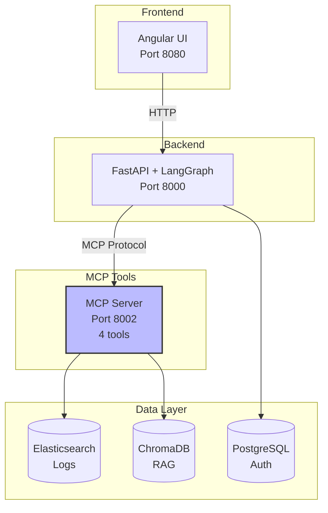

### Arquitetura Proposta (Multi-MCP + ML + Automação)

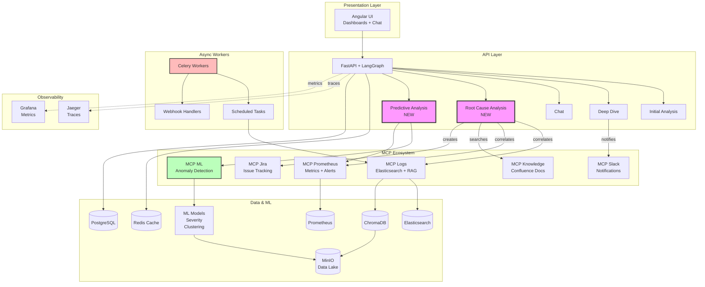

---

## 🔄 Workflows Propostos

### 1. Root Cause Analysis Workflow

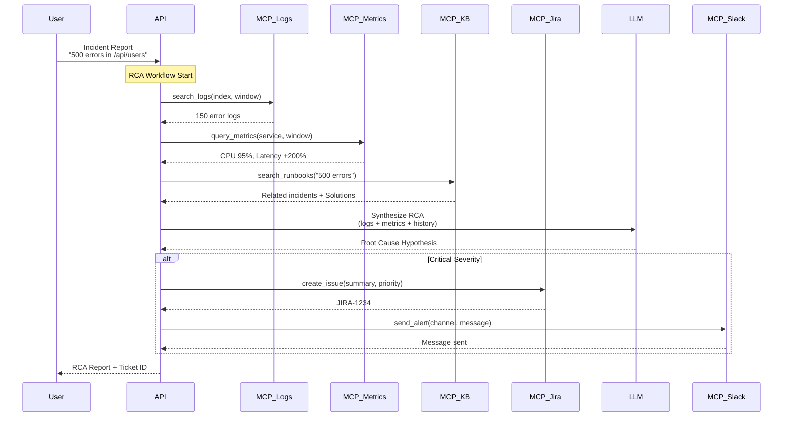

### 2. Scheduled Health Check Workflow

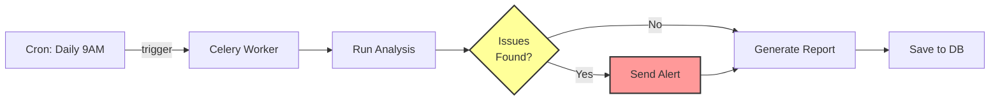

### 3. Multi-Agent Collaboration Pattern

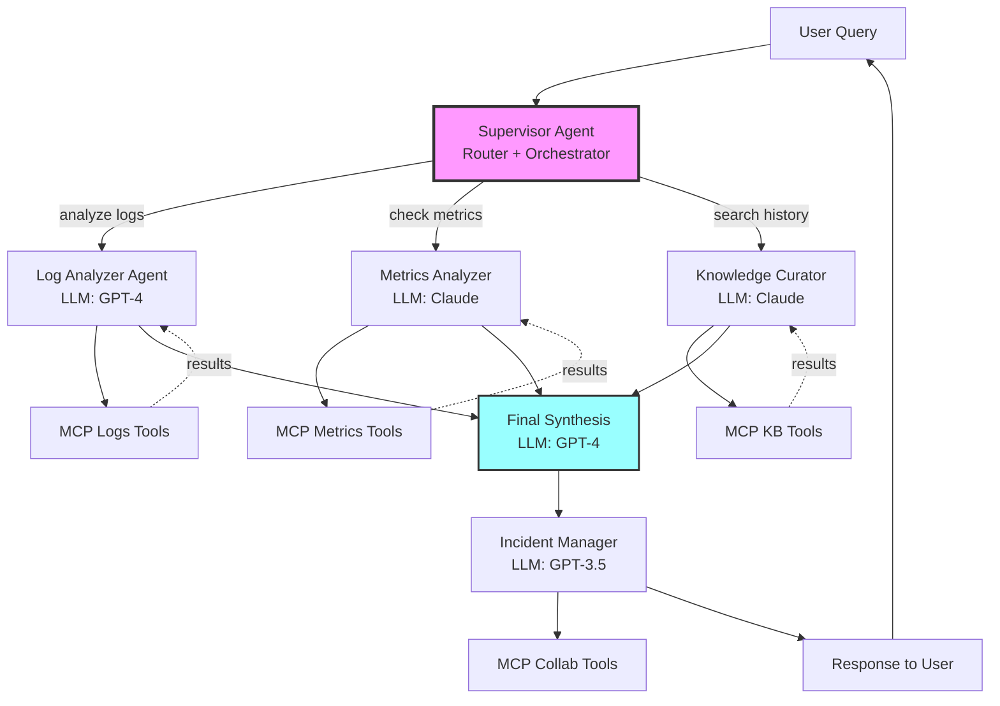

---

## 🧠 Machine Learning Pipeline

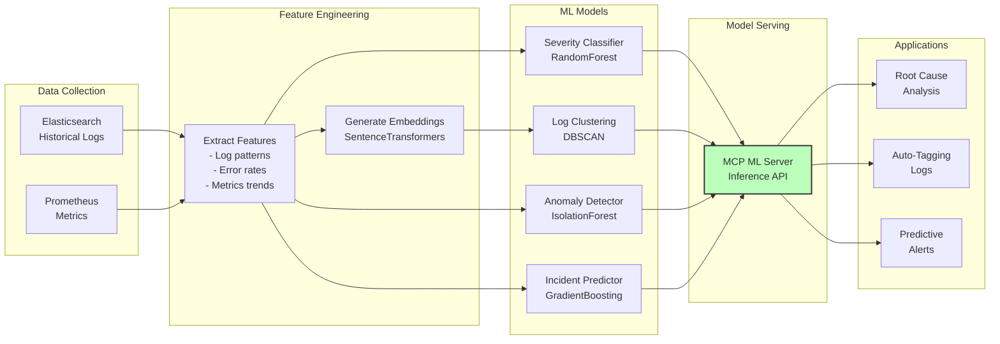

---

## 🔐 Security Architecture

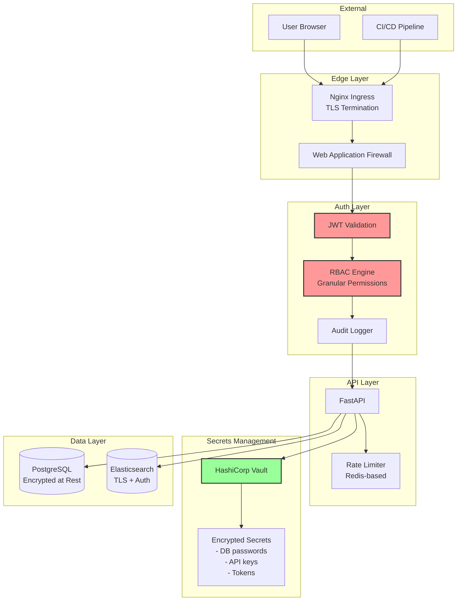

---

## 📊 Data Flow - Analysis Request

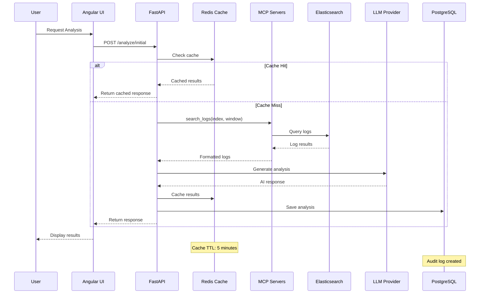

---

## 🎯 Deployment Architecture

### Development Environment

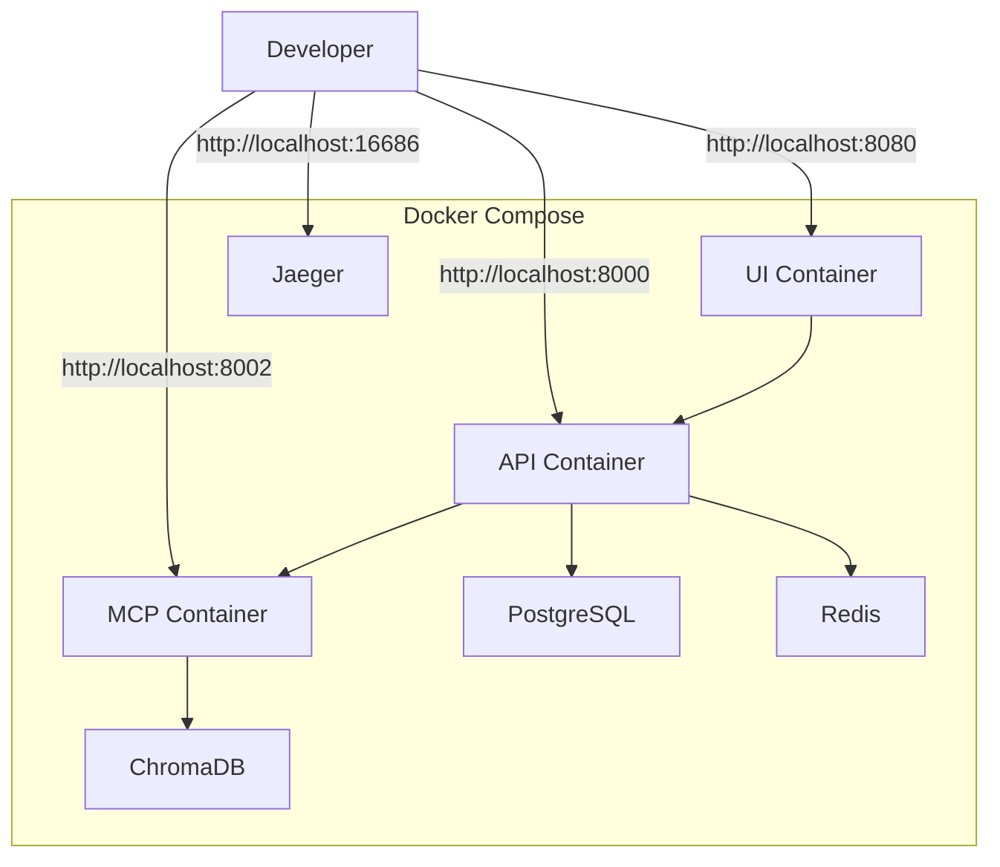

### Production Environment (Kubernetes)

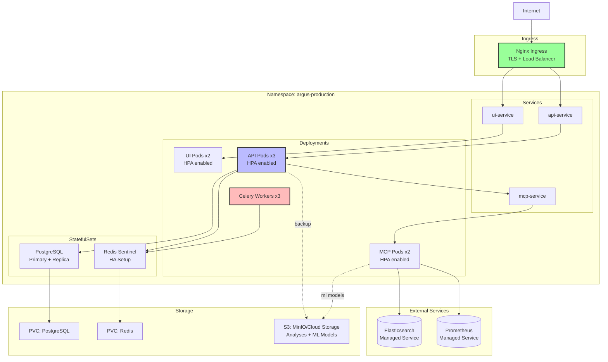

---

## 📈 Scaling Strategy

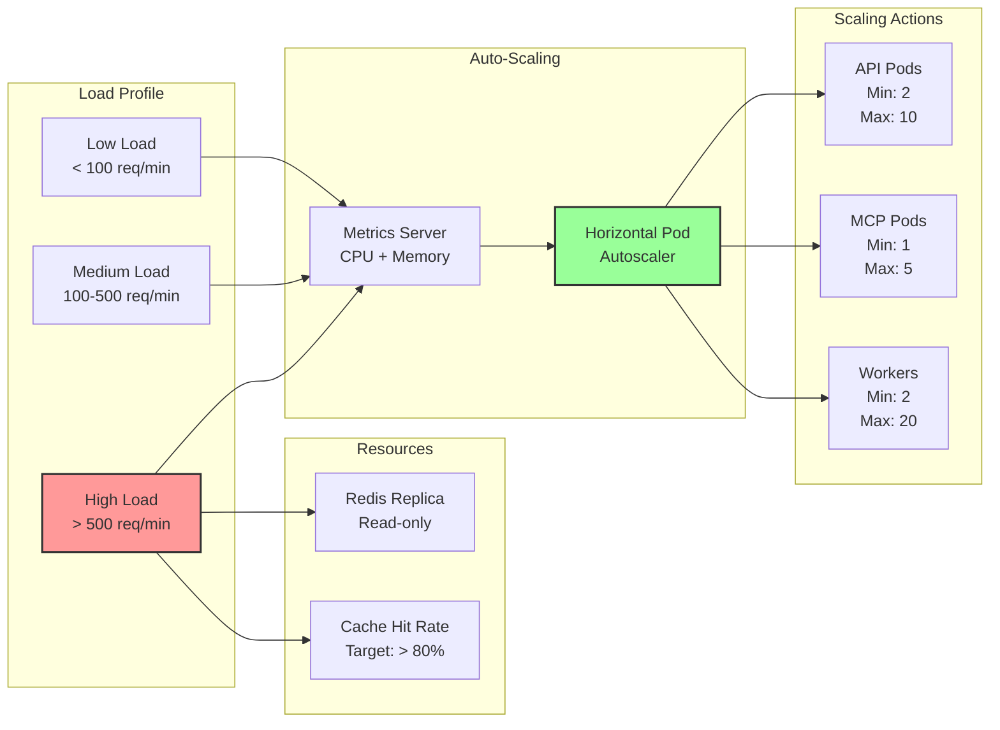

---

## 🔄 CI/CD Pipeline

```mermaid
graph LR
    subgraph "Development"
        DEV[Developer]
        GIT[Git Push]
    end

    subgraph "CI Pipeline"
        LINT[Lint<br/>flake8 + eslint]
        TEST[Unit Tests<br/>pytest + jest]
        BUILD[Build Images<br/>Docker]
        SCAN[Security Scan<br/>Trivy]
    end

    subgraph "CD Pipeline"
        PUSH[Push to Registry<br/>GCR/ACR]
        DEPLOY_DEV[Deploy to Dev<br/>Helm]
        E2E[E2E Tests<br/>Playwright]
        DEPLOY_PROD[Deploy to Prod<br/>Helm]
    end

    subgraph "Post-Deploy"
        ANALYZE[Analyze Logs<br/>via Argus!]
        MONITOR[Monitor Metrics]
        ALERT{Issues?}
        ROLLBACK[Auto Rollback]
    end

    DEV --> GIT
    GIT --> LINT
    LINT --> TEST
    TEST --> BUILD
    BUILD --> SCAN

    SCAN --> PUSH
    PUSH --> DEPLOY_DEV
    DEPLOY_DEV --> E2E

    E2E -->|pass| DEPLOY_PROD
    E2E -->|fail| ROLLBACK

    DEPLOY_PROD --> ANALYZE
    ANALYZE --> MONITOR
    MONITOR --> ALERT

    ALERT -->|Yes| ROLLBACK
    ALERT -->|No| SUCCESS[Success]

    style ANALYZE fill:#9ff,stroke:#333,stroke-width:3px
    style ROLLBACK fill:#f99,stroke:#333,stroke-width:2px
```

---

## 🎓 Referências

- [Model Context Protocol](https://modelcontextprotocol.io/)
- [LangGraph Multi-Agent Systems](https://langchain-ai.github.io/langgraph/tutorials/multi_agent/)
- [OpenTelemetry Best Practices](https://opentelemetry.io/docs/best-practices/)
- [Kubernetes HPA](https://kubernetes.io/docs/tasks/run-application/horizontal-pod-autoscale/)
- [RBAC in FastAPI](https://fastapi.tiangolo.com/advanced/security/)

---

**Última atualização**: 2025-10-10
